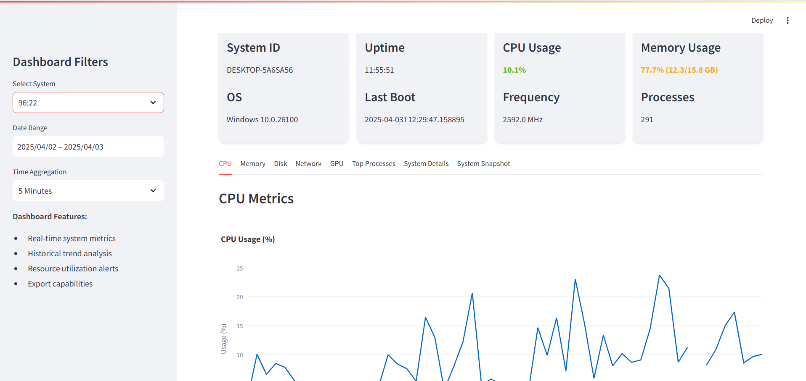

# System Insights

## Overview
A real-time monitoring solution that collects and visualizes system metrics including CPU, memory, disk, network, and GPU usage.



## ✨ Features
- **Real-time Monitoring**
  - CPU usage and load averages
  - Memory utilization (RAM and swap)
  - Disk I/O operations and space usage
  - Network traffic and active connections
  - GPU load and temperature monitoring

- **Historical Analysis**
  - Configurable time ranges (1hr to 30 days)
  - Multiple aggregation levels (1min, 5min, 15min, 1hr)

- **Multi-system Support**
  - Monitor multiple machines from single dashboard
  - System comparison views

## 🛠️ Installation

### Setup
1. Clone repository:
   ```bash
   git clone https://github.com/amrinderguler/System-Insights.git
   cd System-Insights
   ```
2. Install Python dependencies:
    ```bash
    pip install -r requirements.txt
    ```

3. Configure .env
   Insert MongoDB credentials

## 🚀 Usage

1. Data Collection

Run on monitored systems:
```bash
python monitor.py
```

2. Dashboard

Start the visualization interface:
```bash
streamlit run dashboard.py
```
    

